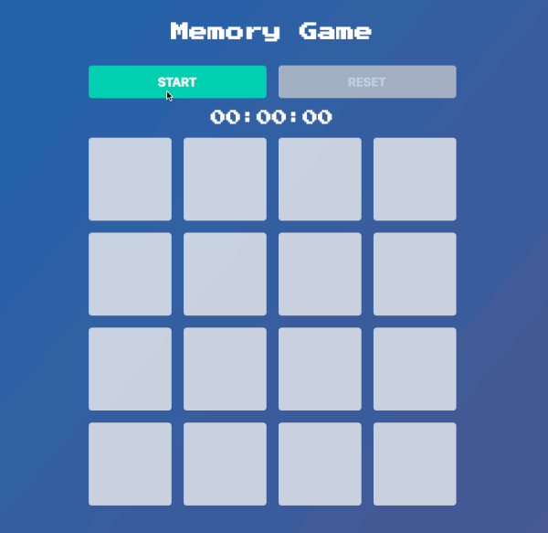

# memory_game_web

A memory game written in [Dart 2](https://dartlang.org) for the web.



To run project:

```bash
$ pub get
$ webdev serve
```

**Demo available at [https://memorygameweb.herokuapp.com](https://memorygameweb.herokuapp.com)**

Created from templates made available by Stagehand under a BSD-style
[license](https://github.com/dart-lang/stagehand/blob/master/LICENSE).
